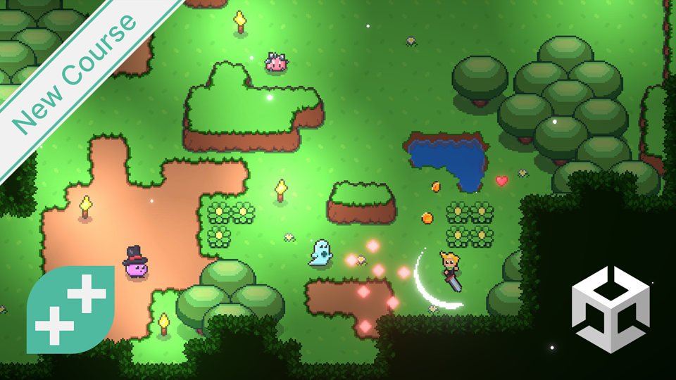

# Unity 2D RPG Combat - EARLY ACCESS

### Reference Image

## Design Notes
Building a 2D RPG Combat system in Unity

## Results of Course Videos
### Section 1 - Introduction & Setup
- Part 1 - 5: These are the introduction to the course and system set up instructions that are common in all the course.  They are using Unity Editor 22.2f1.  My version is 22.1f1.  I am hoping that is close enough that I will not run into issues following the course.  I can update that at a later time if necessary.  Not much else to show for the course in this sections.  I've been using VS Code for years now and already had the necessary extensions from another Unity course I have started.
### Section 2 - Player Movement
- Part 1: The Introduction   
This part was a quick overview of what will be coming through the rest of this section.  No development happens here
- Part 2: Player Input System  
We created a simple sprite (triange) and put it into the middle of our camera view.  Next we incorporated the Unity 2D movement system and linked everything together so we can move the sprite around.  I did the File -> Build and Run and was able to play the game.  Had to close it using Task Manager as there was no exit path built into the game yet.

- Part 3: Import Player Sprites  
The player sprites reels were imported and split into segments.  We then replaced the triange with the first image of the idle player

<!---
- Part 3: Import Player Sprites   

- Part 4: Animating the Player   

- Part 5: Player Physics   

<!---

### Section 3 - Hair and Clothing
- Part 1: Upper Boots   

- Part 2: Lower Boots   

- Part 3: Creases and Details   

- Part 3 (ALT): Baby's Got New Shoes   

- Part 4: The Gloves   

- Part 5: The Trousers   

- Part 5 (ALT): Daisy Dukes   

- Part None (ALT): A Hat  

- Part 6: The Shirt   

- Part 7: The Corset   

- Part 8: The Belt   

- Part 9: The Buckle   

- Part 10: Eye Lashes   

- Part 11: Shirt Drawstring   

- Part 11: Base Hair   

- Part 12: Hair Curves   

### Section 4 - Texturing
- Part 1: Unwrapping the Clothes   

- Part 2: Unwrapping the Body   

- Part 3: Finishing the Unwrap 
No updates on this section
- Part 4: Checking the Unwrap   

- Part 5: Base Colors   

- Part 6: Paint Mask   

- Part 7: Painting the Eyes  

- Part 8: Painting the Iris  

- Part 9: Painting the Face  

- Part 10: Painting the Body  
    - Texture Image

    - Principal BSDF

    - Side by Side

- Part 11: Painting the Pants  

- Part 12: Painting the Boots  

- Part 13: Painting the Shirt  

- Part 14: The Buckle and Drawstring  

- Part 13: The Hair  

### Section 4 - Rigging &amp; Posing
- Part 1: The Armature  

- Part 2-4: No Updates  
- Part 5: Rigging the Clothes  

- Part 6: Masking the Body  

-->